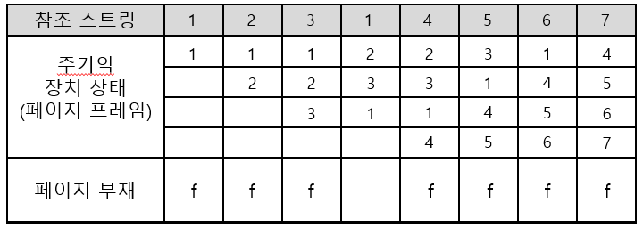
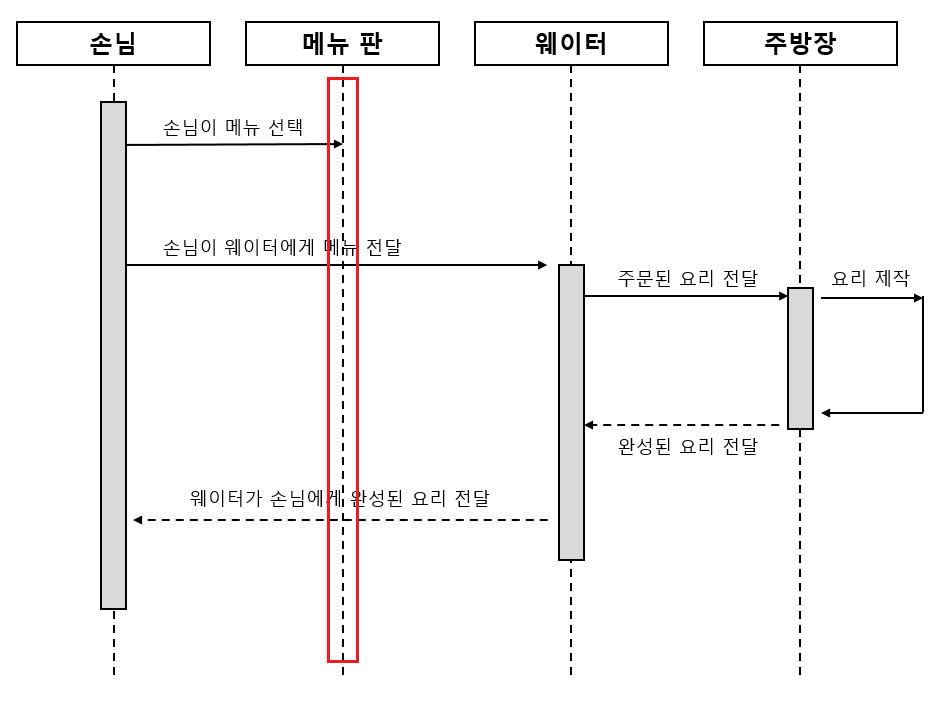
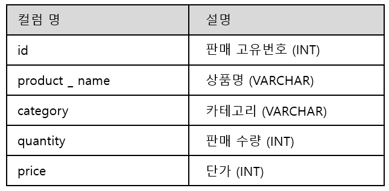
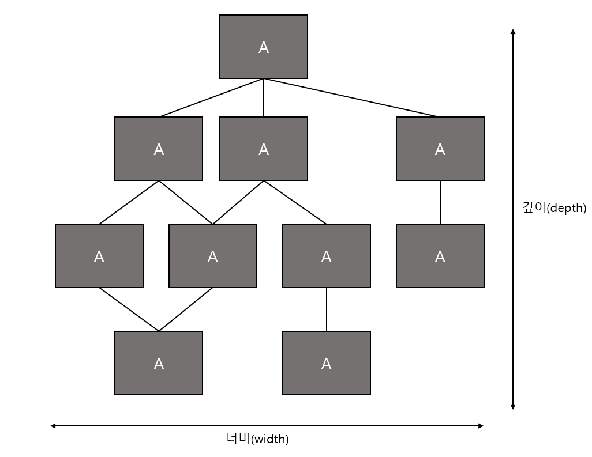

# study
for study with @Naiery0

### 정보 처리 기사 실기

#### 1. 다음 이미지를 보고 문제를 해결하시오.
###### (1) 다음 이미지를 보고 사용된 교체 기법 알고리즘을 빈칸에 작성하시오.
<br>
<details>
    <summary>정답 보기</summary>

    - LRU
</details>

###### (2) 위 (1)의 알고리즘을 사용하여 다음을 계산하시오.
- 프로세스에 3개의 페이지 프레임이 고정으로 할당되어 있고, 초기에 3개의 페이지 프레임들이 모두 비어 있다고 가정한다.<br>
- 다음의 참조 스트링을 처리하는 동안 알고리즘별 페이지 부재가 몇 회 발생하는지 계산한다.<br>
``` ω = 2 3 2 1 5 2 3 5 ```

<details>
    <summary>정답 보기</summary>

    - 5회
</details>

#### 2. 다음은 객체 지향 설계 원칙에 관한 설명이다. 빈칸에 알맞은 원칙을 보기에서 찾아 작성하시오.
보기
``` ⓐISP ⓑDIP ⓒSOP ⓓOCP ⓔPOP ⓕIDS ```

###### (1) 소프트웨어의 구성요소 (컴포넌트, 클래스, 모듈, 함수)는 확장에는 열려있고, 변경에는 닫혀있어야 한다는 원칙 . . . (     )

###### (2) 객체에서 어떤 클래스를 참조해서 사용하는 경우, 그 클래스를 직접 참조하는 것이 아니라 그 대상의 상위 요소인 추상 클래스나 인터페이스로 참조하라는 원칙 . . . (     )

<details>
    <summary>정답 보기</summary>

    - (1) ⓓ OCP 
    - (2) ⓑ DIP
</details>

#### 3. 다음 이미지는 UML 다이어그램 중 하나의 예시이다. 빈칸에 알맞은 답을 작성하시오.
<br>

###### (1) 위 다이어그램의 이름을 작성하시오. . . (     )
###### (2) 위 다이어그램 빨간색 네모가 가리키는 구성 요소은 무엇입니까? . . . (     )

<details>
    <summary>정답 보기</summary>

    - (1) 시퀀스 다이어그램 (Sequence Diagram) 
    - (2) 생명선
</details>

#### 4. 다음 테이블에 대하여 주어진 요구사항을 만족하는 올바른 쿼리문을 작성하시오.
<b>sales</b> 테이블 <br>
<br>

###### 요구사항 :
###### 카테고리별로 총 판매금액을 구하시오.
###### 단, 총 판매금액이 50,000원 이상인 카테고리만 출력하시오.
###### 출력 컬럼 : category, 총 판매금액(total_sales)
###### 총 판매금액 기준으로 내림차순 정렬하시오.

<details>
    <summary>정답 보기</summary>

    - select category, SUM(quantity * price) AS total_sales FROM sales GROUP BY category<br>
    HAVING SUM(quantity * price) >= 50000 ORDER BY total_sales DESC;
</details>

#### 5. 다음은 빅데이터의 특성에 대한 설명이다. 빈칸에 올바른 용어를 작성하시오.

###### (1) 페타바이트 수준의 대규모 데이터. 빅데이터 분석 규모에 관련된 특성. 디지털 정보량이 기하급수적으로 폭증하는 것을 의미 . . . (     )

###### (2) 정형, 비정형, 반정형의 다양한 데이터. 빅데이터 자원 유형에 관련된 특성. 로그, 소셜, 위치 등 데이터 유형이 다양해지는 것을 의미 . . . (     )

###### (3) 빠르게 증가하고 수집되며, 처리되는 데이터. 빅데이터 수집, 분석, 활용 속도와 관련된 특성. 가치 있는 정보 활용을 위해 실시간 분석이 중요해지는 것을 의미 . . . (     )

<details>
    <summary>정답 보기</summary>

    - 데이터의 양 (Volume)
    - 데이터의 다양성 (Variety)
    - 데이터의 속도 (Velocity)
</details>

#### 6. 다음 설명이 무엇을 의미하는 지 작성하시오.

###### 기업에서 운영되는 서로 다른 플랫폼 및 애플리케이션들 간을 하나의 시스템으로 관리 운영할 수 있도록 서비스 중심의 통합을 지향하는 아키텍처이다.
###### 미들웨어 (Bus)를 중심으로 각각 프로토콜이 호환할 수 있도록 애플리케이션의 통합을 느슨한 결합 방식으로 지원하는 방식이다.

<details>
    <summary>정답 보기</summary>

    - ESB (Enterprise Service Bus)
</details>

#### 7. 다음 설명이 무엇을 의미하는 지 작성하시오.

###### 서버 계층에서 애플리케이션이 동작할 수 있는 환경을 제공하고 안정적인 트랜잭션 처리와 관리, 다른 이기종 시스템과의 애플리케이션을 연동을 지원하는 서버
###### 동적 콘텐츠 (Servlet, JSP)를 처리하기 위해 사용
###### 주요 제품으로 Tomcat, Weblogic, Jeus, Resin 등 존재

<details>
    <summary>정답 보기</summary>

    - WAS (Web Application Server)
</details>

#### 8. 다음은 응집도의 유형에 관한 설명이다. 빈칸에 알맞은 유형을 보기에서 골라 작성하시오.
보기
``` ⓐ Communication Cohesion ⓑ Functional Cohesion ⓒ Procedural Cohesion ⓓ Temporal Cohesion```
``` ⓔ Coincidental Cohesion ⓕ Sequential Cohesion ⓖ Logical Cohesion```

###### (1) 모듈이 다수의 관련 기능을 가질 때 모듈 안의 구성요소들이 그 기능을 순차적으로 수행할 경우의 응집도 . . . (     )

###### (2) 동일한 입력과 출력을 사용하여 다른 기능을 수행하는 활동들이 모여있을 경우의 응집도 . . . (     )

###### (3) 모듈 내부의 모든 기능이 단일한 목적을 위해 수행되는 경우의 응집도 . . . (     )

<details>
    <summary>정답 보기</summary>

    - (1) ⓒ Procedural Cohesion
    - (2) ⓐ Communication Cohesion
    - (3) ⓑ Functional Cohesion
</details>

#### 9. 다음은 시스템 보안을 위협하는 공격 기법 중 하나의 설명이다. 빈칸에 알맞은 용어를 작성하시오.

###### (     )은(는) 어떤 제품이나 컴퓨터 시스템, 암호 시스템 혹은 알고리즘에서 정상적인 인증 절차를 우회하는 기법이다. (     )은(는) 어떤 고정된 형태가 있는 것은 아니라 프로그램 일부로 감춰져 있으르 수도 있고, 독자적인 프로그램이나 하드웨어 모습을 갖기도 한다. 해커는 (     )를 통해서 이용자 몰래 컴퓨터에 접속하여 악의적인 행위를 하기도 한다.

<details>
    <summary>정답 보기</summary>

    - 백도어 (Backdoor)
</details>

#### 10. 소스 코드 품질 분석을 위해 작성된 소스 코드를 실행시키지 않고, 코드 자체만으로 코딩 표준 준수 여부, 코딩 스타일 적정 여부, 잔존 결함 발견 여부를 확인하는 코드 분석 도구 유형을 무엇이라고 하는가?

<details>
    <summary>정답 보기</summary>

    - 정적 분석 도구
</details>

#### 11. 다음 주어진 네트워크 주소를 각각 최대 30개의 호스트를 수용할 수 있는 서브넷들로 나누려고 한다. 다음 물음에 올바른 답을 작성하시오.

``` 192.168.10.0 /24 ```

###### (1) 해당 요구사항을 만족하기 위해 필요한 서브넷 마스크는 무엇인가?

###### (2) 가능한 서브넷의 개수는 몇 개인가?

###### (3) 각 서브넷에서 사용할 수 있는 호스트 IP의 개수는 몇 개 인가?

###### (4) 첫 번째 서브넷의 네트워크 주소, 브로드캐스트 주소, 그리고 할당 가능한 호스트 범위를 작성하시오.

<details>
    <summary>정답 보기</summary>

    - 255.255.255.224 혹은 /27
    - 8
    - 30
    - 네트워크 주소 : 192.168.10.0, 브로드캐스트 주소 : 192.168.10.31, 할당 가능한 호스트 범위 : 192.168.10.1 ~ 192.168.10.30
</details>

#### 12. 다음 설명이 의미하는 정보 보안 침해 공격 기법을 작성하시오.

###### QR코드를 통해 악성 앱 다운을 유도하거나 설치하도록 하게 하는 기법

<details>
    <summary>정답 보기</summary>

    - Qshing (큐싱)
</details>

#### 13. 다음 중 DDL 명령어가 아닌 것은?
``` ⓐ TRUNCATE ⓑ DROP ⓒ ALTER ⓓ CREATE ⓔ REVOKE```

<details>
    <summary>정답 보기</summary>

    - ⓔ REVOKE 
</details>

#### 14. CREATE TABLE 명령어를 사용하여 테이블을 만드려고 한다. 다음과 같은 조건을 만족하는 테이블을 생성하려고 할 때, 빈칸에 알맞은 명령어를 작성하시오.

``` 사원 테이블은 사번, 부서번호의 컬럼을 갖는다. 두 컬럼은 모두 VARCHAR(10)의 데이터 타입을 갖고 있으며 NULL이 들어갈 수 없다.```

###### CREATE TABLE 사원(사번 VARCHAR(10) (  ?  ), 부서번호 VARCHAR(10) (  ?  ));

#### 15. 다음은 DROP TABLE 명령어의 옵션에 대한 설명이다. 빈칸에 알맞은 옵션을 작성하시오.

###### (1) (     ) : 참조하는 테이블까지 연쇄적으로 제거하는 옵션
###### (2) (     ) : 다른 테이블이 삭제할 테이블을 참조 중이면 제거하지 않는 옵션

<details>
    <summary>정답 보기</summary>

    - (1) CASCADE
    - (2) RESTRICT
</details>

#### 16. SELECT 명령어를 사용하여 데이터를 조회할 때 "중복된 속성이 조회될 경우 그 중 한 개만 검색"이라는 의미를 가진 옵션은 무엇인가?

<details>
    <summary>정답 보기</summary>

    - DISTINCT
</details>

#### 17. 학생 테이블에 주소 속성을 추가하는 SQL 문을 작성하시오.

###### (  1  ) TABLE 학생 (  2  ) wnth VARCHAR(20);

<details>
    <summary>정답 보기</summary>

    - (1) ALTER
    - (2) ADD
</details>

#### 18. 개발환경 구성을 위한 도구는 크게 4가지로 분류할 수 있다. 다음 각 도구들의 예시를 보고 어떤 도구를 의미하는 것 인지 보기에서 찾아 작성하시오.

``` ⓐ 구현 도구 ⓑ 테스트 도구 ⓒ 형상관리 도구 ⓓ 빌드 도구 ```

###### (1) : xUnit, PMD, Findbugs, Cppcheck,SonarQube
###### (2) : Ant, Maven, Gradle
###### (3) : Eclipse, IntelliJ, Spring Tool Suite, Visual Studio
###### (4) : CVS, Subversion, Git

<details>
    <summary>정답 보기</summary>

    - (1) ⓑ
    - (2) ⓓ
    - (3) ⓐ
    - (4) ⓒ
</details>

#### 19. 다음은 결합도에 관한 설명이다. 설명을 보고 각 빈칸에 올바른 결합도를 작성하시오.

###### (1) : 모듈 간의 인터페이스로 배열이나 객체, 구조 등이 전달되는 경우의 결합도
###### (2) : 모듈 간의 인터페이스로 전달되는 파라미터를 통해서만 모듈 간의 상호 작용이 일어나는 경우의 결합도

<details>
    <summary>정답 보기</summary>

    - (1) 스탬프 결합도
    - (2) 자료 결합도
</details>

#### 20. 다음 그림을 보고 모듈 F의 팬 인과 팬 아웃을 작성하시오.
<br>

<details>
    <summary>정답 보기</summary>

    - 팬 인 : 2, 팬 아웃: 1
</details>

#### 21. 다음은 해시 암호화 알고리즘의 종류 중 하나에 대한 설명이다. 설명을 보고 일치하는 알고리즘을 작성하시오.

###### Secure Hash Alorithm 알고리즘의 한 종류로서 256비트의 해시값을 생성하는 해시함수

<details>
    <summary>정답 보기</summary>

    - SHA-256
</details>

#### 22. 다음이 설명하는 것이 무엇인지 작성하시오.

###### 일반적인 네트워크 방화벽과는 달리 웹 애플리케이션 보안에 특화된 보안장비. SQL 인젝션, XSS 등과 같은 웹 공격을 탐지하고 차단하는 기능

<details>
    <summary>정답 보기</summary>

    - WAF (Web Application Firewall)
</details>

#### 23. 다음 설명을 보고 알맞은 용어를 보기에서 찾아 작성하시오.
<b>보기</b><br>

``` ⓐ IDS ⓑ IPS ⓒ VPN ⓓ NAC ⓔ NAT ⓕ UTM ```

###### (1) : 네트워크에서 발생하는 이벤트를 모니터링하고 비인가 사용자에 의한 자원접근과 보안정책 위반 행위(침입)을 실시간으로 탐지하는 시스템

###### (2) : 네트워크에 대한 공격이나 침입을 실시간적으로 차단하고, 유해트래픽에 대한 조치를 능동적으로 처리하는 시스템

<details>
    <summary>정답 보기</summary>

    - (1) ⓐ IDS
    - (2) ⓑ IPS
</details>

#### 24. 테스트 오라클은 테스트의 결과가 참인지 거짓인지를 판단하기 위해서 사전에 정의된 참값을 입력하여 비교하는 기법을 의미한다. 그 중 모든 입력값에 대하여 기대하는 결과를 생성함으로써 발생된 오류를 모두 검출할 수 있는 오라클은 무엇인가?

<details>
    <summary>정답 보기</summary>

    - 참 오라클
</details>

#### 25. 다음 설명이 의미하는 테스트가 무엇인지 작성하시오.

###### 실제 환경에서 일정 수의 사용자에게 대상 소프트웨어를 사용하게 하고 피드백을 받는 인수 테스트

<details>
    <summary>정답 보기</summary>

    - 베타 테스트
</details>

#### 26. 다음 빈칸에 들어갈 알맞은 용어를 작성하시오.

###### 하향식 통합 테스트는 프로그램의 상위 모듈에서 하위 모듈 방향으로 통합하면서 테스트하는 기법이다. 하향식 통합 테스트는 하위 모듈에서 반환 값을 전달하기 위한 더미 모듈인 (     )을 사용한다.

<details>
    <summary>정답 보기</summary>

    - 스텁(Stub)
</details>

#### 27. 리눅스/유닉스 환경에서 쉘에서 특정 PID 프로세스를 종료하기 위해 사용할 수 있는 명령어는 무엇인가?

<details>
    <summary>정답 보기</summary>

    - kill
</details>

#### 28. 다음은 프로세스 스케줄링의 유형에 관한 설명이다. 빈칸에 알맞은 답안을 작성하시오.

###### (     ) : 하나의 프로세스가 CPU를 차지하고 있을 때, 우선 순위가 높은 다른 프로세스가 현재 프로세스를 중단싴니고 CPU를 점유하는 스케줄링 방식을 의미한다. 알고리즘으로 SRT, 다단계 큐, 다단계 피드백 큐, RR 등이 있다.

<details>
    <summary>정답 보기</summary>

    - 선점형 스케줄링
</details>

#### 29. 다음 용어가 의미하는 것이 무엇인지 작성하시오.

###### 네트워크 또는 서버에 가해지는 부하를 분산시켜 처리해주는 기법을 의미한다. 라운드 로빈 방식이나 해시 방식 등을 적용할 수 있다.

<details>
    <summary>정답 보기</summary>

    - 로드 밸런싱
</details>

#### 30. 다음 보기 중 데이터 링크 계층의 프로토콜이 아닌 것은?
<b>보기</b><br>

``` ⓐ HDLC ⓑ ARP ⓒ PPP ⓓ Frame Relay ⓔ ATM ```

<details>
    <summary>정답 보기</summary>

    - ⓑ ARP
</details>

#### 31. 아래의 내용에서 빈칸의 알맞은 용어를 영문 약자로 작성하시오.

###### 오류 제어는 데이터 전송의 신뢰성을 위해 반드시 필요한 기능이다. 오류 제어 방식에는 ( ㄱ ) 과 ( ㄴ ) 이 있다. ( ㄱ ) 은 데이터 전송 과정에서 발생한 오류를 검출하여 검출된 오류를 재전송 요구 없이 스스로 수정하는 방식으로 해밍 코드 등이 있다. ( ㄴ ) 은 데이터 전송 과정에서 오류가 발생하면 송신 측에 재전송을 요구하는 방식으로 패리티 검사, CRC, 블록합 검사, ARQ 등이 있다.

<details>
    <summary>정답 보기</summary>

    - ㄱ. FEC
    - ㄴ. BEC
</details>

#### 32. 다음이 설명하는 프로토콜이 무엇인지 작성하시오.

###### 인터넷이나 로컬 영역에서 네트워크 연결에 사용되는 네트워크 프로토콜이다. 23번 포트를 사용한다.

<details>
    <summary>정답 보기</summary>

    - Telnet
</details>